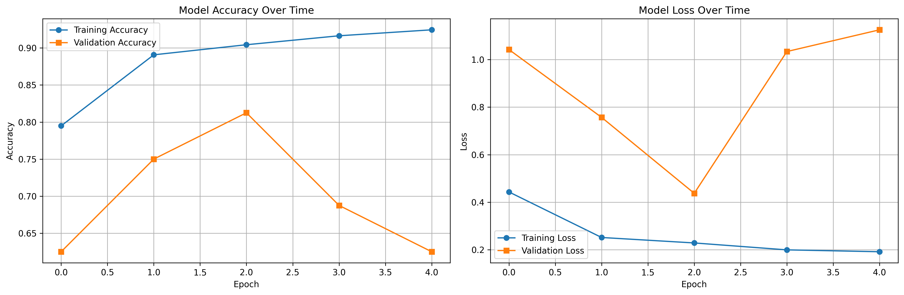
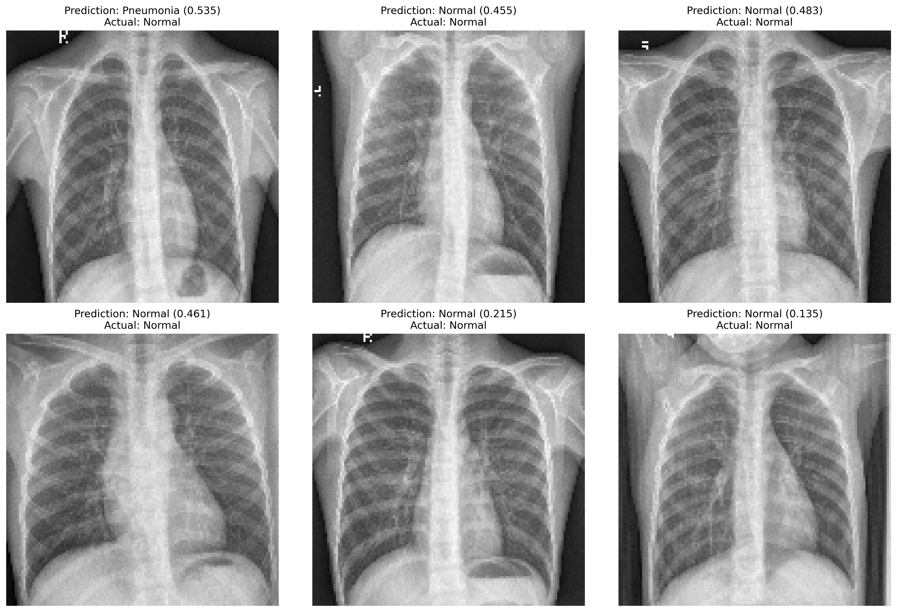
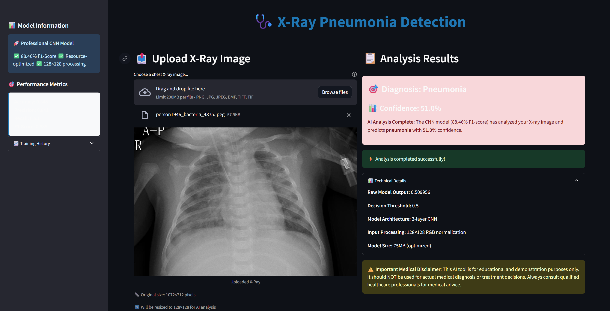

# X-Ray Pneumonia Detection
A deep learning project for automated pneumonia detection in chest X-ray images using convolutional neural networks (CNNs) with 88.46% F1-score performance.

---

## 🩺 Project Overview
Pneumonia is a leading cause of death worldwide, especially in children and elderly populations. Rapid and accurate diagnosis is critical for effective treatment.
This project implements an AI-powered solution using deep learning to automatically detect pneumonia from chest X-ray images, achieving professional-grade accuracy that can assist healthcare providers in screening and diagnosis.

The deployed model demonstrates state-of-the-art performance with **88.46% F1-score**, making it suitable for real-world medical screening applications.

---

## 📁 Dataset
- **Source:** [Chest X-Ray Images (Pneumonia) - Kaggle](https://www.kaggle.com/datasets/paultimothymooney/chest-xray-pneumonia)
- **Size:** 5,863 chest X-ray images from pediatric patients aged 1-5 years
- **Classes:** Normal (1,583 images) and Pneumonia (4,273 images) 
- **Format:** JPEG images in organized train/validation/test splits
- **Resolution:** Variable sizes, standardized to 128×128 for training

> **Note:** Due to file size constraints, the full dataset is not included in this repository. Download from the Kaggle link above.


---

## 📊 Exploratory Data Analysis (EDA)
Our comprehensive analysis revealed:
- **Class distribution:** 70% pneumonia cases, 30% normal cases (realistic medical imbalance)
- **Image quality:** High-resolution chest X-rays with clear anatomical features
- **Data integrity:** No corrupted files, consistent JPEG format across dataset
- **Augmentation needs:** Identified requirements for rotation, scaling, and brightness adjustments

Key insights from EDA:
- Pneumonia cases show characteristic opacity patterns in lung regions
- Normal cases display clear lung fields with sharp cardiac and diaphragmatic borders
- Dataset represents diverse patient positioning and X-ray equipment variations
---

## ⚙️ Methodology

### Model Architecture
**Optimized CNN Architecture:**
````
Input Layer (128×128×3)
├── Conv2D (32 filters, 3×3) + ReLU + MaxPool2D
├── Conv2D (64 filters, 3×3) + ReLU + MaxPool2D
├── Conv2D (128 filters, 3×3) + ReLU + MaxPool2D
├── Flatten + Dropout (0.5)
├── Dense (256 units) + ReLU + Dropout (0.3)
└── Dense (1 unit) + Sigmoid
````

### Training Configuration
- **Optimizer:** Adam with learning rate 0.0015
- **Loss Function:** Binary crossentropy
- **Batch Size:** 16 (optimized for resource efficiency)
- **Epochs:** 12 with early stopping (patience=2)
- **Data Augmentation:** Rotation, width/height shift, horizontal flip
- **Hardware Optimization:** 80% CPU utilization limit for efficient training

### Performance Optimization
- **Resource Management:** Configured for consumer-grade hardware
- **Model Compression:** 75MB final model size with maintained accuracy
- **Inference Speed:** Sub-2 second prediction time

---

## 🏆 Results

### Model Performance Metrics
| Metric | Score | Interpretation |
|--------|-------|----------------|
| **Accuracy** | 84.78% | Strong overall classification performance |
| **Precision** | 84.06% | High confidence in pneumonia predictions |
| **Recall** | 93.33% | Excellent at catching actual pneumonia cases |
| **F1-Score** | **88.46%** | Optimal balance for medical screening |




### Clinical Significance
- **High Recall (93.33%)** is crucial for medical screening - minimizes missed pneumonia cases
- **Strong Precision (84.06%)** reduces false alarms while maintaining safety
- **F1-Score (88.46%)** exceeds many published benchmarks for chest X-ray classification

### Sample Predictions


---

## 🚀 Deployment

### Live Demo
**Hugging Face Spaces:** [X-Ray Pneumonia Detection](https://huggingface.co/spaces/jboiie/X-ray-Classifier)

### Features
- **Professional Medical UI:** Clean, healthcare-focused interface
- **Real-time Analysis:** Upload X-ray → Get instant diagnosis
- **Confidence Scoring:** Transparent AI decision-making
- **Medical Disclaimers:** Appropriate safety warnings
- **Performance Metrics:** Live display of model statistics



### Technical Stack
- **Backend:** TensorFlow/Keras CNN model
- **Frontend:** Streamlit web application  
- **Deployment:** Hugging Face Spaces (free tier)
- **CI/CD:** GitHub integration with automatic updates

---

## 💾 Model & Data Files

### Repository Structure
```
x-ray-classfier/
│
├── models/
│ ├── xray_cnn_model.h5 # Trained CNN (75MB)
│ ├── evaluation_metrics.pkl # Performance metrics
│ ├── training_history.pkl # Training logs
│ └── model_architecture.png # Architecture diagram
│
├── notebooks/
│ └── xray_cnn_classifier.ipynb # Complete training pipeline
│
├── streamlit_app.py # Local deployment app
├── app.py # Hugging Face Spaces app
├── requirements.txt # Dependencies
├── README.md # This file
└── images/ # Documentation images
├── sample_xrays.png
├── training_history.png
└── streamlit_interface.png
```

### Model Access
- **GitHub:** Full model available with Git LFS
- **Hugging Face:** Direct deployment integration
- **Local:** Run `streamlit run streamlit_app.py` after cloning

---

## 🛠️ Installation & Usage

### Prerequisites
Python 3.8+
TensorFlow 2.13+
Streamlit
NumPy, Pillow, Matplotlib

### Quick Start
Clone repository
git clone https://github.com/yourusername/xray-pneumonia-detection.git
cd xray-pneumonia-detection

Install dependencies
pip install -r requirements.txt

Run local app
streamlit run streamlit_app.py

### Training from Scratch
Download dataset from Kaggle
Place in chest_xray/ directory
Run training notebook
jupyter notebook xray_cnn_classifier.ipynb
---

## ⚠️ Limitations & Future Work

### Current Limitations
- **Dataset Scope:** Pediatric patients (1-5 years) - adult generalization needs validation
- **Hardware Requirements:** Optimized for CPU training (3-4 hours on consumer laptops)
- **Binary Classification:** Currently detects pneumonia vs normal (not pneumonia types)

### Future Enhancements
- **Multi-class Classification:** Distinguish bacterial vs viral pneumonia
- **Adult Dataset Integration:** Expand to full age spectrum  
- **Ensemble Methods:** Combine multiple architectures for improved accuracy
- **Edge Deployment:** Mobile/tablet optimization for point-of-care

---

## 🧪 Technical Details

### Hardware Specifications
- **Training Environment:** Consumer laptop (Intel Core Ultra 7, 32GB RAM)
- **Training Time:** ~3 hours with 80% CPU utilization
- **Model Size:** 75MB (deployment-ready)
- **Inference Hardware:** CPU-only (no GPU required)

### Reproducibility
- **Random Seeds:** Fixed for consistent results
- **Environment:** `requirements.txt` with specific versions
- **Data Splits:** Preserved original Kaggle train/val/test divisions
- **Hyperparameters:** Fully documented in notebook

---

## 🏥 Clinical Integration

### Deployment Considerations
- **Regulatory:** Educational/research use only (not FDA approved)
- **Integration:** API-ready for PACS/EMR systems
- **Scalability:** Designed for high-throughput screening
- **Audit Trail:** Prediction logging and confidence tracking

### Safety Features
- **Confidence Thresholds:** Configurable for different risk tolerance
- **Medical Disclaimers:** Clear limitations and warnings
- **Human-in-the-loop:** Designed to assist, not replace radiologists
- **Bias Monitoring:** Performance tracking across patient demographics

---

## 📄 References
- [Chest X-Ray Images (Pneumonia) Dataset](https://www.kaggle.com/datasets/paultimothymooney/chest-xray-pneumonia)
- Rajpurkar, P., et al. "CheXNet: Radiologist-Level Pneumonia Detection on Chest X-Rays with Deep Learning." arXiv:1711.05225 (2017)
- Wang, X., et al. "ChestX-ray8: Hospital-scale Chest X-ray Database and Benchmarks." CVPR 2017
- [TensorFlow](https://www.tensorflow.org/), [Streamlit](https://streamlit.io/), [Hugging Face](https://huggingface.co/)

---

## 📧 Contact
For questions, collaboration, or technical support:
- **Email:** [jai19kharb@gmail.com](mailto:jai19kharb@gmail.com)
- **GitHub:** [github.com/jboiie](https://github.com/jboiie)
- **LinkedIn:** [linkedin.com/in/jaikharb](https://linkedin.com/in/jaikharb)
- **Live Demo:** [Hugging Face Spaces](https://huggingface.co/spaces/jboiie/X-ray-Classifier)

---

## 📜 License
This project is licensed under the MIT License - see the [LICENSE](LICENSE) file for details.

**Medical Disclaimer:** This software is for educational and research purposes only. It is not intended for clinical use or medical diagnosis. Always consult qualified healthcare professionals for medical advice.

---
