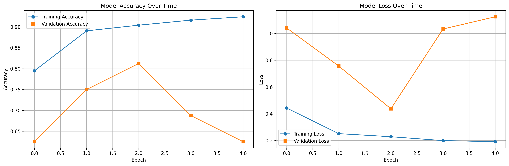
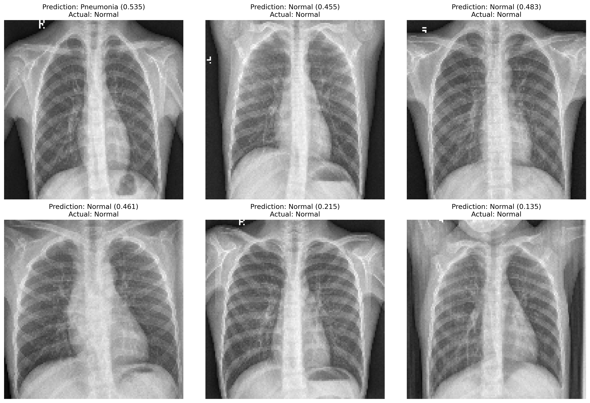
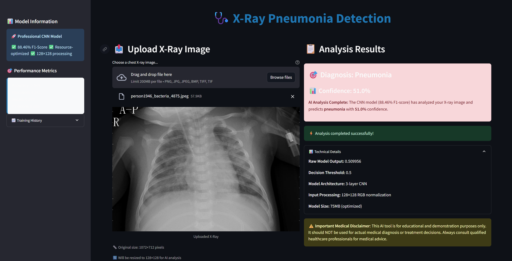

# Pneumonia Detection: Optimized Edge Inference Engine


A resource-constrained Convolutional Neural Network (CNN) engineered for low-latency pneumonia detection on non-GPU hardware. This project demonstrates end-to-end MLOps implementation, from custom model architecture to containerized deployment.

---

## 🎯 Engineering Goal & Motivation

Deep learning models for medical imaging typically require heavy GPU compute, making them inaccessible for edge deployment in resource-limited clinics.

**The Engineering Challenge:**
To engineer a high-recall diagnostic model that runs inference in **under 2 seconds on a standard CPU**, without sacrificing the sensitivity required for medical screening.

**The Solution:**
A custom 3-layer CNN architecture optimized for parameter efficiency, achieving **93.33% Recall** with a total model size of just **75MB**.

---

## ⚡ Key Benchmarks

| Metric | Result | Engineering Impact |
|--------|-------|--------------------|
| **Recall (Sensitivity)** | **93.33%** | Minimized False Negatives (Critical for screening) |
| **Inference Latency** | **< 1.8s** | Viable for real-time CPU deployment |
| **Model Size** | **75MB** | Lightweight, suitable for containerization |
| **F1-Score** | 88.46% | Balanced precision-recall trade-off |

---

## 🏗️ Architecture & MLOps

This project moves beyond a simple notebook to a production-ready artifact using modern DevOps practices.

### 1. Model Architecture
Instead of using a massive pre-trained model like ResNet50 (100MB+), I designed a custom **3-Layer Sequential CNN**:
* **Input:** 150x150x3 (Resized for throughput)
* **Layers:** 3x Conv2D (32/64/128 filters) + MaxPooling + Dropout (0.5)
* **Optimization:** Adam Optimizer, Binary Crossentropy

### 2. DevOps Pipeline
* **Containerization:** The application is fully Dockerized using a multi-stage build to keep the image lightweight.
* **CI/CD:** A GitHub Actions workflow automatically lint-checks the code and attempts a Docker build on every push to `main`, ensuring build integrity.

---

## 📸 Local Inference Demo

*Proof of "Sub-2-Second" Inference on a standard laptop CPU:*






---

## 🚀 How to Run

### Option A: Docker (Recommended)
Run the application in an isolated container without installing Python dependencies.

```
# Build the container
docker build -t pneumonia-app .

# Run on port 8501
docker run -p 8501:8501 pneumonia-app
```
or
```
# 1. Install dependencies (CPU-optimized TensorFlow)
pip install -r requirements.txt

# 2. Launch Interface
streamlit run app.py
```
# file structure
```
x-ray-classifier/
├── .github/workflows/    # CI Pipeline Configuration
├── app/                  # Application Source Code
│   └── main.py           # Streamlit Interface Logic
├── models/               # Serialized Model Artifacts
│   └── xray_cnn_model.h5 # Optimized 75MB Model
├── Dockerfile            # Container Definition
├── Makefile              # Automation Commands
└── requirements.txt      # Dependency Lockfile
```

